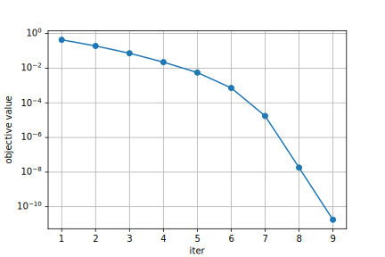

# pdpf
python implementation of Primal-Dual Path-Following for Linear Programming.

This package enables us to solve Linear Programming whose format is `min <c,x> s.t. Ax>=b, x>=0`.

## Instrallation

`pdpf` can be installed with

```shell
pip install git+https://github.com/mirucaaura/pdpf.git
```

`pdpf` has the following dependencies:

- Python >= 3.7
- NumPy >= 1.15
- SciPy >= 1.1.0

## Quickstart

We give an example on how to use this package.

First, import packages:

```python
import numpy as np
from pdpf import PrimalDual
import matplotlib.pyplot as plt
```

Define problem data:

```python
c = np.array([150, 200, 300])
A = np.array([[3, 1, 2],
              [1, 3, 0],
              [0, 2, 4]])
b = np.array([60, 36, 48])
```

Optimize:

```python
model = PrimalDual(c, A, b)
model.minimize()
```

Results can be shown by `model.res`:

```shell
>>> print(model.res)
     fun: array([4.33959524e-01, 1.92708144e-01, 7.28293862e-02, 2.23690150e-02,
       5.60288941e-03, 7.22804096e-04, 1.74412233e-05, 1.81881297e-08,
       1.77633299e-11])
 message: 'Optimization terminated successfully.'
     nit: 9
  status: 0
 success: True
       x: array([12.,  8.,  8.])
```

The history of objective functions can be obtained as follows:

```python
plt.figure(figsize=[6, 4])
plt.xlabel('iter')
plt.ylabel('objective value')
plt.plot(model.res.fun, marker='o')
plt.yscale('log')
plt.grid(True)
```



When calling `minimize()` with `verbose=1`, the output looks like as follows:

```shell
>>> model.minimize(verbose=1)
Iter    theta           f(x)
   1    5.6604e-01      4.3396e-01
   2    5.5593e-01      1.9271e-01
   3    6.2207e-01      7.2829e-02
   4    6.9286e-01      2.2369e-02
   5    7.4952e-01      5.6029e-03
   6    8.7099e-01      7.2280e-04
   7    9.7587e-01      1.7441e-05
   8    9.9896e-01      1.8188e-08
   9    9.9902e-01      1.7763e-11
```

